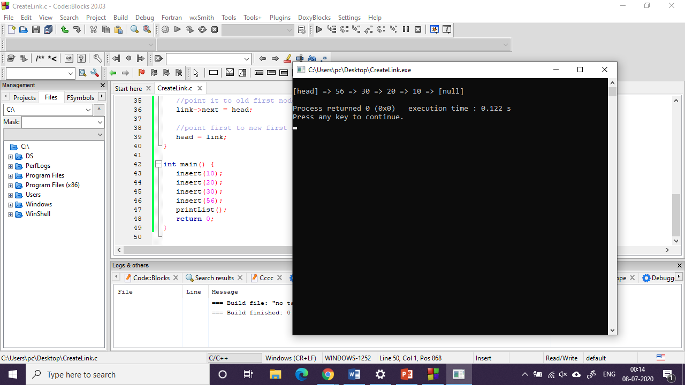

#   Experiment 1
## Aim of the experiment 
Write a program that uses functions to perform the following operations on singly linked list : i) Creation ii) Insertion iii) Deletion iv) Traversal

### Step-by-Step procedure for the experiment
1.
2.
3.

### Output Obtained

